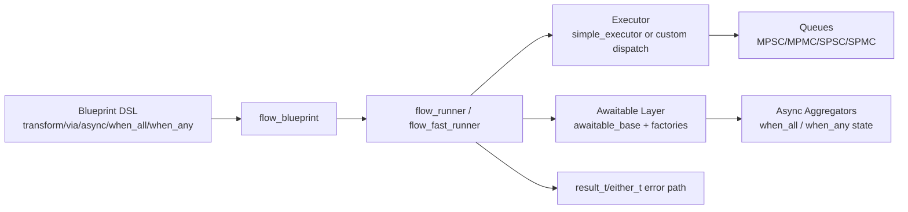

# flux_foundry

> Lightweight C++14 foundations for async flow orchestration, lock-free queues, and low-level memory building blocks.

## ✨ Overview

`flux_foundry` is a header-only C++14 library that combines:

- ⚡ Low-overhead flow pipeline execution (`flow_runner`, `flow_fast_runner`)
- 🔁 Async composition primitives (`flow_async`, `await_when_all`, `await_when_any`)
- 🧠 Memory/data primitives (`result_t`, `either_t`, `flat_storage`, `lite_ptr`, `inplace`)
- 🧵 Queue/executor infrastructure (`spsc/mpsc/mpmc/spmc`, `simple_executor`, `gsource_executor`)

The project is tuned for predictable behavior and explicit contracts under concurrency.

## 🧩 Components

| Module | Main files | What it provides |
|---|---|---|
| `flow/` | `flow_node.h`, `flow_blueprint.h`, `flow_runner.h`, `flow_async_aggregator.h`, `flow_awaitable.h` | Pipeline DSL, node graph flattening, async steps, `when_all/when_any`, cancel/error propagation |
| `executor/` | `simple_executor.h`, `gsource_executor.h` | MPSC single-consumer executor, GLib source-backed executor |
| `utility/` | `concurrent_queues.h`, `callable_wrapper.h`, `back_off.h` | Lock-free queues, callable type-erasure with SBO, backoff policies |
| `task/` | `task_wrapper.h`, `future_task.h` | Task wrappers and future-related task abstraction |
| `memory/` | `result_t.h`, `either_t.h`, `flat_storage.h`, `lite_ptr.h`, `inplace_t.h`, `padded_t.h`, `hazard_ptr.h` | Result/error transport, tagged unions, storage composition, smart pointer, inplace construction helpers, padding/alignment primitives |
| `base/` | `traits.h`, `type_erase_base.h`, `inplace_base.h`, `type_utility.h` | Traits/macros and low-level reusable base utilities |

## 🚀 Quick Start (CMake)

```bash
cmake -S . -B build -DFLUX_FOUNDRY_BUILD_TESTS=ON
cmake --build build --config Release
ctest --test-dir build -C Release --output-on-failure
```

Run specific suites:

```bash
ctest --test-dir build -C Release -L smoke  --output-on-failure
ctest --test-dir build -C Release -L stress --output-on-failure
ctest --test-dir build -C Release -L perf   --output-on-failure
```

## ✅ CI

GitHub Actions workflow: `.github/workflows/ci.yml`

- OS matrix: `ubuntu-latest`, `windows-latest`
- Build: CMake + C++14
- Test gate: `ctest -L smoke`

This keeps PR checks fast while still validating the core flow path on both platforms.

## 🛠 Flow DSL at a glance

```cpp
#include "flow/flow.h"

using namespace flux_foundry;
using E = std::exception_ptr;

struct inline_executor {
    void dispatch(task_wrapper_sbo t) noexcept { t(); }
};

struct plus_one_awaitable : awaitable_base<plus_one_awaitable, int, E> {
    using async_result_type = result_t<int, E>;
    int v;

    explicit plus_one_awaitable(async_result_type&& in) noexcept
        : v(in.has_value() ? in.value() : 0) {}

    int submit() noexcept {
        this->resume(async_result_type(value_tag, v + 1));
        return 0;
    }

    void cancel() noexcept {}
};

int main() {
    inline_executor ex;

    auto bp = make_blueprint<int>()
        | transform([](int x) noexcept { return x + 1; })
        | await<plus_one_awaitable>(&ex)
        | end();

    auto bp_ptr = make_lite_ptr<decltype(bp)>(std::move(bp));
    auto runner = make_runner(bp_ptr);
    runner(1);
}
```

## 🏗 Architecture sketch



## 🔧 Key contracts

### `simple_executor`

- `run()`:
  - single-consumer only
  - non-reentrant on the same thread
- `try_shutdown()`:
  - attempts `running -> shutdown`
  - returns `true` when shutdown is already visible/succeeded
- `dispatch()` after shutdown:
  - treated as invalid usage (`assert` + `abort`)

### Flow runner

- Strongly typed node IO (`result_t<T, E>`)
- Explicit cancel path via `flow_controller`
- Async node submit/cancel lifecycle managed through `awaitable_base`

## 📊 Benchmark snapshot (local run)

Command:

```bash
cmake -S . -B build -DFLUX_FOUNDRY_BUILD_TESTS=ON
cmake --build build --config Release --target lfnds_flow_perf
ctest --test-dir build -C Release -R flow_perf --output-on-failure
```

Measured output (`2026-02-11`, local machine):

- Device: `Microsoft Surface Pro 7` (`x64-based PC`)
- CPU: `Intel Core i5-1035G4` (4 cores / 8 threads)
- Memory: `8 GB` RAM (`8155709440` bytes reported by WMI)
- GPU: `Intel Iris Plus Graphics`
- OS: `Windows 10 Home` (`10.0.19045`, `64-bit`)
- Compiler: `clang++ 21.1.0` (`target: x86_64-pc-windows-msvc`)

| Case | total | ns/op |
|---|---:|---:|
| `direct.loop20` | 5.391 ms | 1.08 |
| `runner.sync.20nodes` | 87.245 ms | 43.62 |
| `fast_runner.sync.20nodes` | 20.592 ms | 6.86 |
| `runner.async.4nodes` | 1197.195 ms | 1496.49 |
| `runner.when_all.2` | 279.624 ms | 932.08 |
| `runner.when_any.2` | 234.322 ms | 781.07 |

Notes:

- This is a microbenchmark for framework overhead, not an end-to-end application benchmark.
- `fast_runner` significantly reduces pure pipeline overhead in this setup.
- Absolute numbers depend on CPU/compiler/flags.

## 🧪 Stress validation snapshot

Command:

```bash
cmake -S . -B build -DFLUX_FOUNDRY_BUILD_TESTS=ON
cmake --build build --config Release --target lfnds_flow_state_stress
ctest --test-dir build -C Release -R flow_state_stress --output-on-failure
```

Result summary (local run):

- ✅ `[PASS] state-machine stress passed`
- `async cancel race`: 5000/5000 completed, `timeout=0`, `duplicate_callback=0`
- `submit fail path`: 5000/5000 completed, all classified as submit-fail as expected
- `when_all cancel race`: 1500/1500 completed, `timeout=0`
- `when_any cancel race`: 1500/1500 completed, `timeout=0`

## 📁 Repository layout

```text
base/
CMakeLists.txt
executor/
flow/
memory/
task/
utility/
test/
test/CMakeLists.txt
test/bin/      # generated probe executables
README.md
```

## 📦 Requirements

- C++14 compiler (Clang/GCC/MSVC)
- CMake 3.16+

## 📌 Notes

- Core library remains header-only.
- Probe/stress/perf sources live in `test/` (`*.cpp`).
- Generated binaries are written to `test/bin/`.

## 📜 License

MIT
