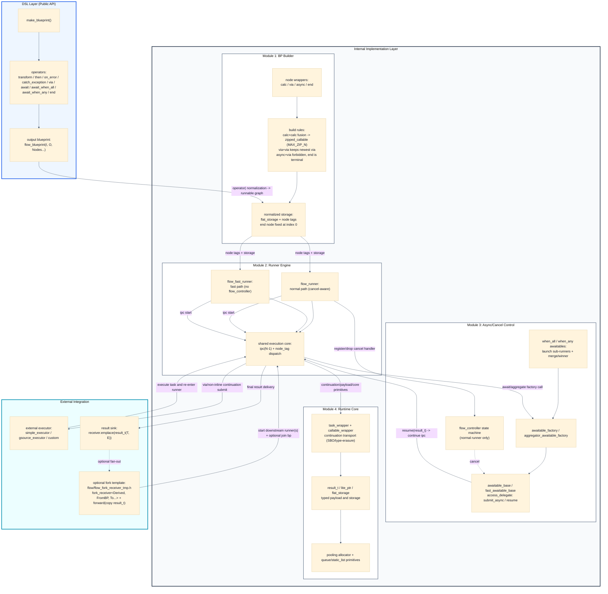
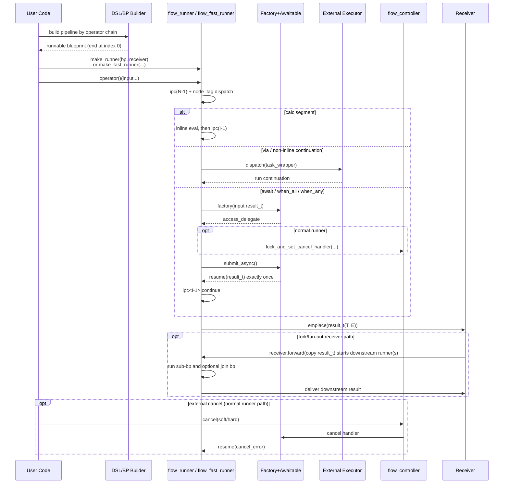

# flux_foundry

> Lightweight C++14 foundations for async flow orchestration, lock-free queues, and low-level memory building blocks.

## ✨ Overview

`flux_foundry` is a **header-only** C++14 library that combines:

- ⚡ Low-overhead flow pipeline execution (`flow_runner`, `flow_fast_runner`)
- 🔁 Flow DSL operators (`transform`, `then`, `on_error`, `catch_exception`, `via`, `await`, `await_when_all`, `await_when_any`, `await_when_all_fast`, `await_when_any_fast`)
- 🧠 Memory/data primitives (`result_t`, `either_t`, `flat_storage`, `lite_ptr`, `inplace_t`, `pooling allocator`)
- 🧵 Queue/executor infrastructure (`spsc/mpsc/mpmc/spmc`, `simple_executor`, `gsource_executor`)

The project is tuned for predictable behavior and explicit contracts under concurrency.

## 🎯 Positioning

- `flux_foundry` is built for low-latency C++ systems where predictable behavior, explicit concurrency contracts, and composable flow semantics matter more than beginner ergonomics.
- Best-fit scenarios: systems infrastructure, trading/market-data style pipelines, and custom backend integration (for example io_uring/DPDK-style poll loops via awaitable + executor contracts).
- Hot-path focus: `fast_runner` + sync/inline execution targets near hand-written overhead in benchmarked scenarios.
- Tradeoff: the library expects strong C++ template/concurrency fluency; it is a power-user DSL, not a beginner abstraction layer.

## 🧩 Components

| Module | Main files                                                                                                               | What it provides |
|---|--------------------------------------------------------------------------------------------------------------------------|---|
| `flow/` | `flow_node.h`, `flow_blueprint.h`, `flow_runner.h`, `flow_async_aggregator.h`, `flow_awaitable.h`                        | Pipeline DSL (`transform/then/on_error/catch_exception/via/await`), node graph flattening, async steps, `when_all/when_any`, cancel/error propagation |
| `executor/` | `simple_executor.h`, `gsource_executor.h`                                                                                | MPSC single-consumer executor, GLib source-backed executor |
| `utility/` | `concurrent_queues.h`, `callable_wrapper.h`, `back_off.h`                                                                | Lock-free queues, callable type-erasure with SBO, backoff policies |
| `task/` | `task_wrapper.h`, `future_task.h`                                                                                        | Task wrappers and future-related task abstraction |
| `memory/` | `result_t.h`, `either_t.h`, `flat_storage.h`, `lite_ptr.h`, `inplace_t.h`, `padded_t.h`, `hazard_ptr.h`, `pooling.h` | Result/error transport, tagged unions, storage composition, smart pointer, inplace construction helpers, padding/alignment primitives |
| `base/` | `traits.h`, `type_erase_base.h`, `inplace_base.h`, `type_utility.h`                                                      | Traits/macros and low-level reusable base utilities |

## 🚀 Quick Start (CMake)

```bash
cmake -S . -B build -DFLUX_FOUNDRY_BUILD_TESTS=ON
cmake --build build --config Release
ctest --test-dir build -C Release --output-on-failure
```

Run specific suites:

```bash
ctest --test-dir build -C Release -L smoke  --output-on-failure
ctest --test-dir build -C Release -L stress --output-on-failure
ctest --test-dir build -C Release -L perf   --output-on-failure
```

## ✅ CI

GitHub Actions workflow: `.github/workflows/ci.yml`

- OS matrix: `ubuntu-latest`, `windows-latest`
- Build: CMake + C++14
- Test gate: `ctest -L smoke`

This keeps PR checks fast while still validating the core flow path on both platforms.

## 🛠 Flow DSL at a glance

```cpp
#include "flow/flow.h"

using namespace flux_foundry;
using E = std::exception_ptr;

struct inline_executor {
    void dispatch(task_wrapper_sbo t) noexcept { t(); }
};

struct plus_one_awaitable final : awaitable_base<plus_one_awaitable, int, E> {
    using async_result_type = result_t<int, E>;
    int v;

    explicit plus_one_awaitable(async_result_type&& in) noexcept
        : v(in.has_value() ? in.value() : 0) {}

    int submit() noexcept {
        this->resume(async_result_type(value_tag, v + 1));
        return 0;
    }

    void cancel() noexcept {}
};

int main() {
    inline_executor ex;

    auto bp = make_blueprint<int>()
        | transform([](int x) noexcept { return (x ^ 0x5a5a5a5a) + (x >> 3); })
        | then([](result_t<int, E>&& in) noexcept -> result_t<int, E> {
            if (!in.has_value()) {
                return result_t<int, E>(error_tag, std::move(in).error());
            }
            return result_t<int, E>(value_tag, in.value() * 2);
        })
        | on_error([](result_t<int, E>&&) noexcept -> result_t<int, E> {
            return result_t<int, E>(value_tag, -1); // recover from non-exception errors
        })
#if FLUX_FOUNDRY_COMPILER_HAS_EXCEPTIONS
        | catch_exception<std::runtime_error>([](const std::runtime_error&) noexcept {
            return -2; // recover from std::runtime_error
        })
#endif
        | await<plus_one_awaitable>(&ex)
        | end();

    auto bp_ptr = make_lite_ptr<decltype(bp)>(std::move(bp));
    auto runner = make_runner(bp_ptr);
    runner(1);
}
```

### `await_when_all` minimal demo (compilable)

```cpp
#include "flow/flow.h"
#include <cstdio>
#include <utility>

using namespace flux_foundry;
using E = flow_async_agg_err_t;
using out_t = result_t<int, E>;

struct print_receiver {
    using value_type = out_t;

    void emplace(value_type&& r) noexcept {
        if (r.has_value()) {
            std::printf("when_all value=%d\n", r.value());
        } else {
            std::printf("when_all error\n");
        }
    }
};

int main() {
    auto leaf1 = make_blueprint<int>()
        | transform([](int x) noexcept { return x + 10; })
        | end();

    auto leaf2 = make_blueprint<int>()
        | transform([](int x) noexcept { return x + 20; })
        | end();

    auto p1 = make_lite_ptr<decltype(leaf1)>(std::move(leaf1));
    auto p2 = make_lite_ptr<decltype(leaf2)>(std::move(leaf2));

    auto bp = await_when_all(
        [](int a, int b) noexcept {
            return out_t(value_tag, a + b);
        },
        [](flow_async_agg_err_t e) noexcept {
            return out_t(error_tag, std::move(e));
        },
        p1,
        p2)
        | end();

    auto bp_ptr = make_lite_ptr<decltype(bp)>(std::move(bp));
    auto runner = make_runner(bp_ptr, print_receiver{});
    runner(1, 2); // prints: when_all value=33
}
```

### `await_when_any` minimal demo (compilable)

```cpp
#include "flow/flow.h"
#include <cstdio>
#include <utility>

using namespace flux_foundry;
using E = flow_async_agg_err_t;
using out_t = result_t<int, E>;

struct print_receiver {
    using value_type = out_t;

    void emplace(value_type&& r) noexcept {
        if (r.has_value()) {
            std::printf("when_any winner value=%d\n", r.value());
        } else {
            std::printf("when_any error\n");
        }
    }
};

int main() {
    auto leaf1 = make_blueprint<int>()
        | transform([](int x) noexcept { return x + 100; })
        | end();

    auto leaf2 = make_blueprint<int>()
        | transform([](int x) noexcept { return x + 200; })
        | end();

    auto p1 = make_lite_ptr<decltype(leaf1)>(std::move(leaf1));
    auto p2 = make_lite_ptr<decltype(leaf2)>(std::move(leaf2));

    auto bp = await_when_any(
        [](size_t i, int x) noexcept {
            (void)i; // winner index
            return out_t(value_tag, x);
        },
        [](flow_async_agg_err_t e) noexcept {
            return out_t(error_tag, std::move(e));
        },
        p1,
        p2)
        | end();

    auto bp_ptr = make_lite_ptr<decltype(bp)>(std::move(bp));
    auto runner = make_runner(bp_ptr, print_receiver{});
    runner(1, 2); // winner value is usually 101 or 202
}
```

## 🏗 Architecture sketch

High-resolution export (architecture + sequence in one SVG): [`architecture_overview.svg`](architecture_overview.svg)


```mermaid
%%{init: {
  'theme': 'base',
  'themeVariables': {
    'fontSize': '16px',
    'lineColor': '#475569',
    'primaryTextColor': '#0f172a',
    'clusterBorder': '#64748b',
    'clusterBkg': '#f8fafc'
  },
  'flowchart': {
    'nodeSpacing': 60,
    'rankSpacing': 70,
    'padding': 20
  }
}}%%
flowchart TB
  subgraph DSL["DSL Layer (Public API)"]
    D0["make_blueprint()"]
    D1["operators:<br/>transform / then / on_error / catch_exception / via / await / await_when_all / await_when_any / end"]
    D2["output blueprint:<br/>flow_blueprint(I, O, Nodes...)"]
    D0 --> D1 --> D2
  end

  subgraph IMPL["Internal Implementation Layer"]
    direction LR

    subgraph ASYNC_MOD["Module 3: Async/Cancel Control"]
      A0["awaitable_factory / aggregator_awaitable_factory"]
      A1["awaitable_base / fast_awaitable_base<br/>access_delegate: submit_async / resume"]
      A2["flow_controller state machine<br/>(normal runner only)"]
      A3["when_all / when_any awaitables:<br/>launch sub-runners + merge/winner"]
      A0 --> A1
      A3 --> A0
      A2 -. cancel .-> A1
    end

    subgraph BP_MOD["Module 1: BP Builder"]
      B0["node wrappers:<br/>calc / via / async / end"]
      B1["build rules:<br/>calc+calc fusion -> zipped_callable (MAX_ZIP_N)<br/>via+via keeps newest via<br/>async+via forbidden, end is terminal"]
      B2["normalized storage:<br/>flat_storage + node tags<br/>end node fixed at index 0"]
      B0 --> B1 --> B2
    end

    subgraph RUN_MOD["Module 2: Runner Engine"]
      R0["flow_runner:<br/>normal path (cancel-aware)"]
      R1["flow_fast_runner:<br/>fast path (no flow_controller)"]
      R2["shared execution core:<br/>ipc(N-1) + node_tag dispatch"]
      R0 --> R2
      R1 --> R2
    end

    subgraph CORE_MOD["Module 4: Runtime Core"]
      C0["task_wrapper + callable_wrapper<br/>continuation transport (SBO/type-erasure)"]
      C1["result_t / lite_ptr / flat_storage<br/>typed payload and storage"]
      C2["pooling allocator + queue/static_list primitives"]
      C0 --> C1 --> C2
    end
  end

  subgraph EXT["External Integration"]
    X0["external executor:<br/>simple_executor / gsource_executor / custom"]
    X1["result sink:<br/>receiver.emplace(result_t(T, E))"]
    X2["optional fork template:<br/>flow/flow_fork_receiver_tmp.h<br/>fork_receiver&lt;Derived, FromBP, To...&gt; + forward(copy result_t)"]
  end

  D2 -->|"operator| normalization -> runnable graph"| B2
  B2 -->|"node tags + storage"| R0
  B2 -->|"node tags + storage"| R1
  R0 -->|"ipc start"| R2
  R1 -->|"ipc start"| R2
  R2 -->|"await/aggregate factory call"| A0
  A1 -->|"resume(result_t) -> continue ipc"| R2
  R0 -->|"register/drop cancel handler"| A2
  R2 -->|"continuation/payload/core primitives"| C0
  R2 -->|"via/non-inline continuation submit"| X0
  X0 -->|"execute task and re-enter runner"| R2
  R2 -->|"final result delivery"| X1
  X1 -. "optional fan-out" .-> X2
  X2 -->|"start downstream runner(s) + optional join bp"| R2

  classDef big font-size:16px,stroke-width:1.8px,padding:12px;
  class D0,D1,D2,B0,B1,B2,R0,R1,R2,A0,A1,A2,A3,C0,C1,C2,X0,X1,X2 big;

  style DSL fill:#eef6ff,stroke:#2563eb,stroke-width:3px
  style IMPL fill:#f8fafc,stroke:#334155,stroke-width:3px
  style EXT fill:#ecfeff,stroke:#0891b2,stroke-width:3px
  style BP_MOD fill:#ffffff,stroke:#64748b,stroke-width:2px
  style RUN_MOD fill:#ffffff,stroke:#64748b,stroke-width:2px
  style ASYNC_MOD fill:#ffffff,stroke:#64748b,stroke-width:2px
  style CORE_MOD fill:#ffffff,stroke:#64748b,stroke-width:2px
```


```mermaid
sequenceDiagram
  participant U as User Code
  participant D as DSL/BP Builder
  participant R as flow_runner / flow_fast_runner
  participant A as Factory+Awaitable
  participant X as External Executor
  participant C as flow_controller
  participant S as Receiver

  U->>D: build pipeline by operator chain
  D-->>U: runnable blueprint (end at index 0)
  U->>R: make_runner(bp, receiver)<br/>or make_fast_runner(...)
  U->>R: operator()(input...)
  R->>R: ipc(N-1) + node_tag dispatch

  alt calc segment
    R->>R: inline eval, then ipc(I-1)
  else via / non-inline continuation
    R->>X: dispatch(task_wrapper)
    X-->>R: run continuation
  else await / when_all / when_any
    R->>A: factory(input result_t)
    A-->>R: access_delegate
    opt normal runner
      R->>C: lock_and_set_cancel_handler(...)
    end
    R->>A: submit_async()
    A-->>R: resume(result_t) exactly once
    R->>R: ipc<I-1> continue
  end

  R->>S: emplace(result_t(T, E))

  opt fork/fan-out receiver path
    S->>R: receiver.forward(copy result_t) starts downstream runner(s)
    R->>R: run sub-bp and optional join bp
    R->>S: deliver downstream result
  end

  opt external cancel (normal runner path)
    U->>C: cancel(soft/hard)
    C->>A: cancel handler
    A-->>R: resume(cancel_error)
  end
```

## 🔧 Key contracts

### `simple_executor`

- `run()`:
  - single-consumer only
  - non-reentrant on the same thread
- `try_shutdown()`:
  - attempts `running -> shutdown`
  - returns `true` when shutdown is already visible/succeeded
- `dispatch()` after shutdown:
  - treated as invalid usage (`assert` + `abort`)

### Flow runner

- Strongly typed node IO (`result_t<T, E>`)
- Explicit cancel path via `flow_controller`
- Async node submit/cancel lifecycle managed through `awaitable_base`

### Fork pattern (template reference)

- `flux_foundry` does not enforce a single fork topology API because downstream start/join strategy is user-defined.
- If you need fork-style fan-out, use the template helper in `flow/flow_fork_receiver_tmp.h` and implement `forward(result_t<T, E>&&) noexcept` in your derived receiver.
- Base template shape: `fork_receiver<Derived, FromBP, To...>`; `Derived::forward(...)` is where you copy/route payload and start downstream runners.
- A complete fork+join reference implementation is in `test/flow_fork_join_semantics_test.cpp` (normal runner, fast runner, and cancel/error branches).

### Fast async lane

- `fast_awaitable_base`:
  - designed for throughput-first async path
  - no awaitable internal state-machine CAS on `submit/resume`
  - contract-based: if `submit()==0`, backend must guarantee `resume()` is called exactly once; if `submit()!=0`, backend must not call `resume()` afterward
- `await_when_all_fast(...)` / `await_when_any_fast(...)`:
  - use fast aggregator awaitables (`flow_when_all_fast_awaitable`, `flow_when_any_fast_awaitable`)
  - run subgraphs with `fast_runner`
  - fast path does not register `flow_controller` cancel handlers
- Recommended combinations:
  - max throughput: `fast_runner + fast awaitable/fast aggregator`
  - full cancellation semantics: `flow_runner + awaitable_base/normal aggregator`

## 📊 Benchmark snapshots
Measured on `2026-03-02` (local machine):

- OS: `Darwin 24.3.0` (`arm64`)
- CPU: `Apple M1 Max` (`10` cores)
- Memory: `64 GB`
- Compiler: `clang++/c++ -std=c++14 -O3 -DNDEBUG`

Commands:

```bash
# flow perf (exception / no-exception)
c++ -std=c++14 -O3 -DNDEBUG -I. test/flow_perf.cpp -o /tmp/flow_perf_exc -pthread
c++ -std=c++14 -O3 -DNDEBUG -fno-exceptions -DFLUX_FOUNDRY_NO_EXCEPTION_STRICT=1 -I. test/flow_perf_noexcept.cpp -o /tmp/flow_perf_noexc -pthread
/tmp/flow_perf_exc
/tmp/flow_perf_noexc

# flux vs asio horizontal compare
bash bench/horizontal_compare/run.sh
bash bench/horizontal_compare/run_noexcept.sh
```

### Flow perf matrix (`ns/op`, median of 7 rounds)

| Case | Exceptions ON | Exceptions OFF |
|---|---:|---:|
| `direct.loop20` | 5.71 | 5.75 |
| `runner.sync.20nodes` | 32.60 | 26.37 |
| `fast_runner.sync.20nodes` | 5.79 | 5.39 |
| `runner.awaitable.async4` | 349.88 | 315.59 |
| `fast_runner.awaitable.async4` | 127.38 | 130.44 |
| `runner.fast_awaitable.async4` | 178.49 | 142.09 |
| `fast_runner.fast_awaitable.async4` | 90.87 | 82.55 |
| `runner.awaitable.async1` | 107.97 | 96.48 |
| `fast_runner.awaitable.async1` | 33.42 | 33.97 |
| `runner.fast_awaitable.async1` | 45.50 | 36.05 |
| `fast_runner.fast_awaitable.async1` | 23.86 | 17.60 |
| `runner.when_all.2` | 154.70 | 141.71 |
| `fast_runner.when_all_fast.2` | 95.48 | 82.74 |
| `runner.when_all_fast.2` | 118.10 | 98.46 |
| `runner.when_any.2` | 143.19 | 122.66 |
| `fast_runner.when_any_fast.2` | 77.23 | 67.63 |
| `runner.when_any_fast.2` | 94.25 | 81.92 |

### Horizontal compare (exceptions ON, core matrix, `ns/op`)

| Case | ns/op |
|---|---:|
| `baseline.direct.loop20` | 5.55 |
| `sched.flux.via20.dispatch` | 212.99 |
| `sched.asio.dispatch20` | 139.76 |
| `sched.flux.via20.post` | 198.97 |
| `sched.asio.post20` | 565.38 |
| `full.flux.runner.async4.post` | 614.37 |
| `full.flux.fast_runner.async4.post` | 411.35 |
| `full.flux.runner.fast_awaitable.async4.post` | 493.82 |
| `full.flux.fast_runner.fast_awaitable.async4.post` | 411.98 |
| `full.asio.post.async4` | 153.59 |
| `full.flux.runner.when_all2.post` | 244.94 |
| `full.flux.fast_runner.when_all2.post` | 192.36 |
| `full.flux.fast_runner.when_all2.fastagg.post` | 182.96 |
| `full.asio.post.when_all2` | 144.50 |
| `full.flux.runner.when_any2.post` | 238.84 |
| `full.flux.fast_runner.when_any2.post` | 173.76 |
| `full.flux.fast_runner.when_any2.fastagg.post` | 167.93 |
| `full.asio.post.when_any2` | 143.06 |

### Horizontal compare (strict no-exception, expanded matrix excerpt, `ns/op`)

| Case | ns/op |
|---|---:|
| `baseline.direct.loop20` | 5.62 |
| `sched.flux.native.via20.inline` | 95.54 |
| `sched.flux.native.via20.dispatch` | 1357.93 |
| `sched.flux.on_asio.via20.dispatch` | 208.57 |
| `sched.asio.raw.dispatch20` | 132.94 |
| `sched.flux.on_asio.via20.post` | 189.65 |
| `sched.asio.raw.post20` | 533.18 |
| `full.flux.native.fast_runner.fast_awaitable.async4.inline` | 80.41 |
| `full.flux.native.fast_runner.fast_awaitable.async1.inline` | 19.96 |
| `full.flux.on_asio.fast_runner.fast_awaitable.async4.dispatch` | 237.48 |
| `full.asio.raw.dispatch.async4` | 80.80 |
| `full.asio.adapter.dispatch.async4` | 131.76 |
| `full.flux.on_asio.fast_runner.fast_awaitable.async4.post` | 318.58 |
| `full.asio.raw.post.async4` | 145.46 |
| `full.asio.adapter.post.async4` | 189.09 |
| `full.flux.on_asio.fast_runner.fast_awaitable.async1.dispatch` | 108.76 |
| `full.asio.raw.dispatch.async1` | 70.48 |
| `full.asio.adapter.dispatch.async1` | 86.11 |
| `full.flux.on_asio.fast_runner.fast_awaitable.async1.post` | 106.04 |
| `full.asio.raw.post.async1` | 70.44 |
| `full.asio.adapter.post.async1` | 86.78 |
| `full.flux.on_asio.fast_runner.when_all2.fastagg.post` | 162.55 |
| `full.asio.raw.post.when_all2` | 137.66 |
| `full.flux.on_asio.fast_runner.when_any2.fastagg.post` | 181.50 |
| `full.asio.raw.post.when_any2` | 132.02 |

### Real backend async overhead (strict no-exception, same host/toolchain, `ns/op`)

| Case | ns/op |
|---|---:|
| `real.flux.fast_runner.fast_awaitable.async4.backend` | 4984.06 |
| `real.asio.raw.async4.backend` | 4707.62 |
| `real.flux.fast_runner.fast_awaitable.async1.backend` | 4851.93 |
| `real.asio.raw.async1.backend` | 4738.65 |


### Windows snapshot (`2026-03-02`, separate local host)

- OS: `Windows 11 Home` (`10.0.26200`, `x64`)
- CPU: `AMD Ryzen 7 3700X` (`8` cores / `16` threads)
- Memory: `31.91 GB`
- Compiler: `clang++ 21.1.0` (`x86_64-pc-windows-msvc`)

Commands (PowerShell equivalent):

```bash
# flow perf (exception / no-exception)
clang++ -std=c++14 -O3 -DNDEBUG -I. test/flow_perf.cpp -o test/bin/flow_perf_exc.exe
clang++ -std=c++14 -O3 -DNDEBUG -fno-exceptions -DFLUX_FOUNDRY_NO_EXCEPTION_STRICT=1 -fno-rtti -march=native -fstrict-aliasing -I. test/flow_perf_noexcept.cpp -o test/bin/flow_perf_noexc.exe
.\test\bin\flow_perf_exc.exe
.\test\bin\flow_perf_noexc.exe

# flux vs asio horizontal compare
# set ASIO include path first, e.g. $env:ASIO_INCLUDE="C:\path\to\asio\include"
clang++ -std=c++14 -O3 -DNDEBUG -pthread -I. -I"$env:ASIO_INCLUDE" bench/horizontal_compare/compare_flux_asio.cpp -o test/bin/flux_asio_horizontal_compare.exe
# NOTE: Asio path uses RTTI internally (typeid), so do NOT pass -fno-rtti here.
clang++ -std=c++14 -O3 -DNDEBUG -fno-exceptions -DFLUX_FOUNDRY_NO_EXCEPTION_STRICT=1 -DASIO_NO_EXCEPTIONS=1 -DASIO_DISABLE_EXCEPTIONS=1 -march=native -fstrict-aliasing -pthread -I. -I"$env:ASIO_INCLUDE" bench/horizontal_compare/compare_flux_asio_noexcept.cpp -o test/bin/flux_asio_horizontal_compare_noexcept.exe
.\test\bin\flux_asio_horizontal_compare.exe
.\test\bin\flux_asio_horizontal_compare_noexcept.exe
```

Windows notes:

- Keep this as a host-specific snapshot; regenerate locally with the command block above.
- The macOS tables in this README are the currently maintained baseline.

### Flow perf matrix (Windows, `ns/op`, median of 7 rounds)

| Case | Exceptions ON | Exceptions OFF |
|---|---:|---:|
| `direct.loop20` | 6.14 | 5.93 |
| `runner.sync.20nodes` | 31.41 | 21.27 |
| `fast_runner.sync.20nodes` | 10.62 | 5.84 |
| `runner.awaitable.async4` | 351.80 | 313.17 |
| `fast_runner.awaitable.async4` | 160.62 | 118.47 |
| `runner.fast_awaitable.async4` | 201.00 | 155.88 |
| `fast_runner.fast_awaitable.async4` | 117.82 | 81.60 |
| `runner.awaitable.async1` | 90.78 | 79.88 |
| `fast_runner.awaitable.async1` | 41.35 | 27.25 |
| `runner.fast_awaitable.async1` | 51.02 | 37.62 |
| `fast_runner.fast_awaitable.async1` | 33.25 | 18.68 |
| `runner.when_all.2` | 202.62 | 187.85 |
| `fast_runner.when_all_fast.2` | 157.65 | 128.37 |
| `runner.when_all_fast.2` | 173.73 | 148.01 |
| `runner.when_any.2` | 178.62 | 159.00 |
| `fast_runner.when_any_fast.2` | 120.11 | 98.49 |
| `runner.when_any_fast.2` | 140.10 | 117.55 |

### Horizontal compare (Windows, exceptions ON, core matrix, `ns/op`)

| Case | ns/op |
|---|---:|
| `baseline.direct.loop20` | 6.07 |
| `sched.flux.via20.dispatch` | 1520.06 |
| `sched.asio.dispatch20` | 1467.20 |
| `sched.flux.via20.post` | 1490.82 |
| `sched.asio.post20` | 9605.10 |
| `full.flux.runner.async4.post` | 3181.42 |
| `full.flux.fast_runner.async4.post` | 3275.80 |
| `full.flux.runner.fast_awaitable.async4.post` | 3639.41 |
| `full.flux.fast_runner.fast_awaitable.async4.post` | 3424.16 |
| `full.asio.post.async4` | 2725.10 |
| `full.flux.runner.when_all2.post` | 1722.61 |
| `full.flux.fast_runner.when_all2.post` | 1848.91 |
| `full.flux.fast_runner.when_all2.fastagg.post` | 1771.33 |
| `full.asio.post.when_all2` | 1940.99 |
| `full.flux.runner.when_any2.post` | 1636.75 |
| `full.flux.fast_runner.when_any2.post` | 1652.85 |
| `full.flux.fast_runner.when_any2.fastagg.post` | 1551.59 |
| `full.asio.post.when_any2` | 1931.10 |

### Horizontal compare (Windows, strict no-exception, expanded matrix excerpt, `ns/op`)

| Case | ns/op |
|---|---:|
| `baseline.direct.loop20` | 5.89 |
| `sched.flux.native.via20.inline` | 72.86 |
| `sched.flux.native.via20.dispatch` | 404.06 |
| `sched.flux.on_asio.via20.dispatch` | 1424.66 |
| `sched.asio.raw.dispatch20` | 1425.52 |
| `sched.flux.on_asio.via20.post` | 1419.61 |
| `sched.asio.raw.post20` | 9533.45 |
| `full.flux.native.fast_runner.fast_awaitable.async4.inline` | 78.12 |
| `full.flux.native.fast_runner.fast_awaitable.async1.inline` | 25.83 |
| `full.flux.on_asio.fast_runner.fast_awaitable.async4.dispatch` | 1715.34 |
| `full.asio.raw.dispatch.async4` | 1474.33 |
| `full.asio.adapter.dispatch.async4` | 1552.46 |
| `full.flux.on_asio.fast_runner.fast_awaitable.async4.post` | 3098.98 |
| `full.asio.raw.post.async4` | 2892.24 |
| `full.asio.adapter.post.async4` | 2895.56 |
| `full.flux.on_asio.fast_runner.fast_awaitable.async1.dispatch` | 1458.18 |
| `full.asio.raw.dispatch.async1` | 1500.19 |
| `full.asio.adapter.dispatch.async1` | 1563.52 |
| `full.flux.on_asio.fast_runner.fast_awaitable.async1.post` | 1500.29 |
| `full.asio.raw.post.async1` | 1424.87 |
| `full.asio.adapter.post.async1` | 1458.67 |
| `full.flux.on_asio.fast_runner.when_all2.fastagg.post` | 1662.84 |
| `full.asio.raw.post.when_all2` | 1936.70 |
| `full.flux.on_asio.fast_runner.when_any2.fastagg.post` | 1511.55 |
| `full.asio.raw.post.when_any2` | 2132.18 |

### Real backend async overhead (Windows, strict no-exception, same host/toolchain, `ns/op`)

| Case | ns/op |
|---|---:|
| `real.flux.fast_runner.fast_awaitable.async4.backend` | 2531.64 |
| `real.asio.raw.async4.backend` | 2111.96 |
| `real.flux.fast_runner.fast_awaitable.async1.backend` | 2169.42 |
| `real.asio.raw.async1.backend` | 2265.26 |

### Linux snapshot (`2026-03-02`, same hardware as Windows snapshot)

- OS: `Ubuntu Linux` (same machine as Windows snapshot, switched OS)
- CPU: `AMD Ryzen 7 3700X` (`8` cores / `16` threads)
- Memory: `31.91 GB`
- Compiler: `clang++ -std=c++14 -O3` (local run log)

Commands (Linux equivalent):

```bash
# flow perf (exception / strict no-exception)
clang++ -std=c++14 -O3 -I. test/flow_perf.cpp -o /tmp/flow_perf_exc -pthread
clang++ -std=c++14 -O3 -fno-exceptions -DFLUX_FOUNDRY_NO_EXCEPTION_STRICT=1 -fno-rtti -march=native -fstrict-aliasing -I. test/flow_perf_noexcept.cpp -o /tmp/flow_perf_noexc -pthread
/tmp/flow_perf_exc
/tmp/flow_perf_noexc

# flux vs asio horizontal compare
bash bench/horizontal_compare/run.sh
bash bench/horizontal_compare/run_noexcept.sh
```

### Flow perf matrix (Linux, `ns/op`, median of 7 rounds)

| Case | Exceptions ON | Exceptions OFF |
|---|---:|---:|
| `direct.loop20` | 5.86 | 5.84 |
| `runner.sync.20nodes` | 26.84 | 23.60 |
| `fast_runner.sync.20nodes` | 5.86 | 5.53 |
| `runner.awaitable.async4` | 375.30 | 324.19 |
| `fast_runner.awaitable.async4` | 124.24 | 109.73 |
| `runner.fast_awaitable.async4` | 221.58 | 169.25 |
| `fast_runner.fast_awaitable.async4` | 93.58 | 81.56 |
| `runner.awaitable.async1` | 94.45 | 82.11 |
| `fast_runner.awaitable.async1` | 30.32 | 28.26 |
| `runner.fast_awaitable.async1` | 55.75 | 43.97 |
| `fast_runner.fast_awaitable.async1` | 18.93 | 17.39 |
| `runner.when_all.2` | 192.97 | 188.08 |
| `fast_runner.when_all_fast.2` | 125.14 | 126.24 |
| `runner.when_all_fast.2` | 156.34 | 154.37 |
| `runner.when_any.2` | 165.42 | 161.51 |
| `fast_runner.when_any_fast.2` | 95.13 | 95.68 |
| `runner.when_any_fast.2` | 129.05 | 125.68 |

### Horizontal compare (Linux, exceptions ON, core matrix, `ns/op`)

| Case | ns/op |
|---|---:|
| `baseline.direct.loop20` | 6.27 |
| `sched.flux.via20.dispatch` | 246.23 |
| `sched.asio.dispatch20` | 159.26 |
| `sched.flux.via20.post` | 247.76 |
| `sched.asio.post20` | 689.79 |
| `full.flux.runner.async4.post` | 703.32 |
| `full.flux.fast_runner.async4.post` | 481.98 |
| `full.flux.runner.fast_awaitable.async4.post` | 639.63 |
| `full.flux.fast_runner.fast_awaitable.async4.post` | 461.71 |
| `full.asio.post.async4` | 187.36 |
| `full.flux.runner.when_all2.post` | 317.02 |
| `full.flux.fast_runner.when_all2.post` | 258.03 |
| `full.flux.fast_runner.when_all2.fastagg.post` | 262.37 |
| `full.asio.post.when_all2` | 141.28 |
| `full.flux.runner.when_any2.post` | 280.62 |
| `full.flux.fast_runner.when_any2.post` | 237.41 |
| `full.flux.fast_runner.when_any2.fastagg.post` | 215.74 |
| `full.asio.post.when_any2` | 126.85 |

### Horizontal compare (Linux, strict no-exception, expanded matrix excerpt, `ns/op`)

| Case | ns/op |
|---|---:|
| `baseline.direct.loop20` | 6.61 |
| `sched.flux.native.via20.inline` | 101.77 |
| `sched.flux.native.via20.dispatch` | 1459.86 |
| `sched.flux.on_asio.via20.dispatch` | 267.01 |
| `sched.asio.raw.dispatch20` | 166.47 |
| `sched.flux.on_asio.via20.post` | 275.68 |
| `sched.asio.raw.post20` | 812.18 |
| `full.flux.native.fast_runner.fast_awaitable.async4.inline` | 86.30 |
| `full.flux.native.fast_runner.fast_awaitable.async1.inline` | 22.02 |
| `full.flux.on_asio.fast_runner.fast_awaitable.async4.dispatch` | 327.29 |
| `full.asio.raw.dispatch.async4` | 105.31 |
| `full.asio.adapter.dispatch.async4` | 181.02 |
| `full.flux.on_asio.fast_runner.fast_awaitable.async4.post` | 459.56 |
| `full.asio.raw.post.async4` | 203.90 |
| `full.asio.adapter.post.async4` | 284.25 |
| `full.flux.on_asio.fast_runner.fast_awaitable.async1.dispatch` | 150.47 |
| `full.asio.raw.dispatch.async1` | 97.04 |
| `full.asio.adapter.dispatch.async1` | 123.47 |
| `full.flux.on_asio.fast_runner.fast_awaitable.async1.post` | 153.20 |
| `full.asio.raw.post.async1` | 97.38 |
| `full.asio.adapter.post.async1` | 123.45 |
| `full.flux.on_asio.fast_runner.when_all2.fastagg.post` | 265.95 |
| `full.asio.raw.post.when_all2` | 144.90 |
| `full.flux.on_asio.fast_runner.when_any2.fastagg.post` | 212.32 |
| `full.asio.raw.post.when_any2` | 145.91 |

### Real backend async overhead (Linux, strict no-exception, same host/toolchain, `ns/op`)

| Case | ns/op |
|---|---:|
| `real.flux.fast_runner.fast_awaitable.async4.backend` | 5012.02 |
| `real.asio.raw.async4.backend` | 4156.70 |
| `real.flux.fast_runner.fast_awaitable.async1.backend` | 4745.71 |
| `real.asio.raw.async1.backend` | 4255.38 |

Notes:

- Linux snapshot above is sourced from `test/ubuntu_bench.txt` (`flow_perf*`) and `bench/horizontal_compare/linux.txt` (`run*.sh`).
- `run_noexcept.sh` currently covers the full expanded matrix (`57` benchmark cases).
- `run.sh` keeps a compact exception-enabled matrix for quick comparison.
- The current tables are product-realistic: they include framework optimizations such as DSL fusion (`via|via` deduplication).
- If you need strict symmetry against raw scheduler APIs, run a separate benchmark profile with those fusion optimizations intentionally disabled.
- This is a microbenchmark for framework overhead, not an end-to-end workload benchmark.

## 🧪 Stress validation snapshot

Command:

```bash
cmake -S . -B build -DFLUX_FOUNDRY_BUILD_TESTS=ON
cmake --build build --config Release --target lfnds_flow_state_stress
ctest --test-dir build -C Release -R flow_state_stress --output-on-failure
```

Result summary (local run):

- ✅ `[PASS] state-machine stress passed`
- `async cancel race`: 5000/5000 completed, `timeout=0`, `duplicate_callback=0`
- `submit fail path`: 5000/5000 completed, all classified as submit-fail as expected
- `when_all` matrix: `normal/cancel`, `normal/no_cancel`, `fast/cancel`, `fast/no_cancel`
- `when_any` matrix: `normal/cancel`, `normal/no_cancel`, `fast/cancel`, `fast/no_cancel`

## 🔬 Formal model checking (TLA+)

In addition to stress/TSAN validation, the repository includes small **TLA+** models for key concurrency protocols in `test/model/`:

- `flow_controller` cancel-state protocol
- `simple_executor` ticket accounting / shutdown-drain
- `awaitable_base` / `fast_awaitable_base` callback lifecycle
- `flow_runner` async-node handshake path
- `flow_async_aggregator` (`when_all` / `when_any`, normal + fast)

These are **abstract protocol models** (not line-by-line C++ proofs) and are intended to complement runtime stress tests and sanitizers.

Run with TLC (example, from repo root):

```bash
java -cp /path/to/tla2tools.jar tlc2.TLC -config test/model/FlowControllerCancel.cfg test/model/FlowControllerCancel.tla
java -cp /path/to/tla2tools.jar tlc2.TLC -config test/model/SimpleExecutorTickets.cfg test/model/SimpleExecutorTickets.tla
```

See `test/model/README.md` for the full model list, assumptions, and additional TLC commands.

## 📁 Repository layout

```text
base/
CMakeLists.txt
executor/
flow/
memory/
task/
utility/
test/
test/CMakeLists.txt
test/bin/      # generated probe executables
README.md
```

## 📦 Requirements

- C++14 compiler (Clang/GCC/MSVC)
- CMake 3.16+

## 📌 Notes

- Core library remains header-only.
- Probe/stress/perf sources live in `test/` (`*.cpp`).
- Generated binaries are written to `test/bin/`.

## 📜 License

MIT

