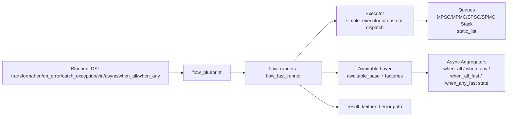

# flux_foundry

> Lightweight C++14 foundations for async flow orchestration, lock-free queues, and low-level memory building blocks.

## ✨ Overview

`flux_foundry` is a **header-only** C++14 library that combines:

- ⚡ Low-overhead flow pipeline execution (`flow_runner`, `flow_fast_runner`)
- 🔁 Flow DSL operators (`transform`, `then`, `on_error`, `catch_exception`, `flow_async`, `await_when_all`, `await_when_any` `await_when_all_fast`, `await_when_any_fast`)
- 🧠 Memory/data primitives (`result_t`, `either_t`, `flat_storage`, `lite_ptr`, `inplace_t`, `pooling tool`)
- 🧵 Queue/executor infrastructure (`spsc/mpsc/mpmc/spmc`, `simple_executor`, `gsource_executor`)

The project is tuned for predictable behavior and explicit contracts under concurrency.

## 🧩 Components

| Module | Main files                                                                                                               | What it provides |
|---|--------------------------------------------------------------------------------------------------------------------------|---|
| `flow/` | `flow_node.h`, `flow_blueprint.h`, `flow_runner.h`, `flow_async_aggregator.h`, `flow_awaitable.h`                        | Pipeline DSL (`transform/then/on_error/catch_exception/via/await`), node graph flattening, async steps, `when_all/when_any`, cancel/error propagation |
| `executor/` | `simple_executor.h`, `gsource_executor.h`                                                                                | MPSC single-consumer executor, GLib source-backed executor |
| `utility/` | `concurrent_queues.h`, `callable_wrapper.h`, `back_off.h`                                                                | Lock-free queues, callable type-erasure with SBO, backoff policies |
| `task/` | `task_wrapper.h`, `future_task.h`                                                                                        | Task wrappers and future-related task abstraction |
| `memory/` | `result_t.h`, `either_t.h`, `flat_storage.h`, `lite_ptr.h`, `inplace_t.h`, `padded_t.h`, `hazard_ptr.h` `pooling.h` | Result/error transport, tagged unions, storage composition, smart pointer, inplace construction helpers, padding/alignment primitives |
| `base/` | `traits.h`, `type_erase_base.h`, `inplace_base.h`, `type_utility.h`                                                      | Traits/macros and low-level reusable base utilities |

## 🚀 Quick Start (CMake)

```bash
cmake -S . -B build -DFLUX_FOUNDRY_BUILD_TESTS=ON
cmake --build build --config Release
ctest --test-dir build -C Release --output-on-failure
```

Run specific suites:

```bash
ctest --test-dir build -C Release -L smoke  --output-on-failure
ctest --test-dir build -C Release -L stress --output-on-failure
ctest --test-dir build -C Release -L perf   --output-on-failure
```

## ✅ CI

GitHub Actions workflow: `.github/workflows/ci.yml`

- OS matrix: `ubuntu-latest`, `windows-latest`
- Build: CMake + C++14
- Test gate: `ctest -L smoke`

This keeps PR checks fast while still validating the core flow path on both platforms.

## 🛠 Flow DSL at a glance

```cpp
#include "flow/flow.h"

using namespace flux_foundry;
using E = std::exception_ptr;

struct inline_executor {
    void dispatch(task_wrapper_sbo t) noexcept { t(); }
};

struct plus_one_awaitable final : awaitable_base<plus_one_awaitable, int, E> {
    using async_result_type = result_t<int, E>;
    int v;

    explicit plus_one_awaitable(async_result_type&& in) noexcept
        : v(in.has_value() ? in.value() : 0) {}

    int submit() noexcept {
        this->resume(async_result_type(value_tag, v + 1));
        return 0;
    }

    void cancel() noexcept {}
};

int main() {
    inline_executor ex;

    auto bp = make_blueprint<int>()
        | transform([](int x) noexcept { return (x ^ 0x5a5a5a5a) + (x >> 3); })
        | then([](result_t<int, E>&& in) noexcept -> result_t<int, E> {
            if (!in.has_value()) {
                return result_t<int, E>(error_tag, std::move(in).error());
            }
            return result_t<int, E>(value_tag, in.value() * 2);
        })
        | on_error([](result_t<int, E>&&) noexcept -> result_t<int, E> {
            return result_t<int, E>(value_tag, -1); // recover from non-exception errors
        })
#if FLUX_FOUNDRY_COMPILER_HAS_EXCEPTIONS
        | catch_exception<std::runtime_error>([](const std::runtime_error&) noexcept {
            return -2; // recover from std::runtime_error
        })
#endif
        | await<plus_one_awaitable>(&ex)
        | end();

    auto bp_ptr = make_lite_ptr<decltype(bp)>(std::move(bp));
    auto runner = make_runner(bp_ptr);
    runner(1);
}
```

### `await_when_all` minimal demo (compilable)

```cpp
#include "flow/flow.h"
#include <cstdio>
#include <utility>

using namespace flux_foundry;
using E = flow_async_agg_err_t;
using out_t = result_t<int, E>;

struct print_receiver {
    using value_type = out_t;

    void emplace(value_type&& r) noexcept {
        if (r.has_value()) {
            std::printf("when_all value=%d\n", r.value());
        } else {
            std::printf("when_all error\n");
        }
    }
};

int main() {
    auto leaf1 = make_blueprint<int>()
        | transform([](int x) noexcept { return x + 10; })
        | end();

    auto leaf2 = make_blueprint<int>()
        | transform([](int x) noexcept { return x + 20; })
        | end();

    auto p1 = make_lite_ptr<decltype(leaf1)>(std::move(leaf1));
    auto p2 = make_lite_ptr<decltype(leaf2)>(std::move(leaf2));

    auto bp = await_when_all(
        [](int a, int b) noexcept {
            return out_t(value_tag, a + b);
        },
        [](flow_async_agg_err_t e) noexcept {
            return out_t(error_tag, std::move(e));
        },
        p1,
        p2)
        | end();

    auto bp_ptr = make_lite_ptr<decltype(bp)>(std::move(bp));
    auto runner = make_runner(bp_ptr, print_receiver{});
    runner(1, 2); // prints: when_all value=33
}
```

### `await_when_any` minimal demo (compilable)

```cpp
#include "flow/flow.h"
#include <cstdio>
#include <utility>

using namespace flux_foundry;
using E = flow_async_agg_err_t;
using out_t = result_t<int, E>;

struct print_receiver {
    using value_type = out_t;

    void emplace(value_type&& r) noexcept {
        if (r.has_value()) {
            std::printf("when_any winner value=%d\n", r.value());
        } else {
            std::printf("when_any error\n");
        }
    }
};

int main() {
    auto leaf1 = make_blueprint<int>()
        | transform([](int x) noexcept { return x + 100; })
        | end();

    auto leaf2 = make_blueprint<int>()
        | transform([](int x) noexcept { return x + 200; })
        | end();

    auto p1 = make_lite_ptr<decltype(leaf1)>(std::move(leaf1));
    auto p2 = make_lite_ptr<decltype(leaf2)>(std::move(leaf2));

    auto bp = await_when_any(
        [](size_t i, int x) noexcept {
            (void)i; // winner index
            return out_t(value_tag, x);
        },
        [](flow_async_agg_err_t e) noexcept {
            return out_t(error_tag, std::move(e));
        },
        p1,
        p2)
        | end();

    auto bp_ptr = make_lite_ptr<decltype(bp)>(std::move(bp));
    auto runner = make_runner(bp_ptr, print_receiver{});
    runner(1, 2); // winner value is usually 101 or 202
}
```

## 🏗 Architecture sketch


```mermaid
flowchart LR
    A[Blueprint DSL<br/>transform/then/on_error/catch_exception/via/async/when_all/when_any] --> B[flow_blueprint]
    B --> C[flow_runner / flow_fast_runner]
    C --> D[Executor<br/>simple_executor or custom dispatch]
    C --> E[Awaitable Layer<br/>awaitable_base + factories]
    E --> F[Async Aggregators<br/>when_all / when_any /<br/>when_all_fast / when_any_fast state]
    C --> G[result_t/either_t error path]
    D --> H[Queues<br/>MPSC/MPMC/SPSC/SPMC Stack<br/>static_list]
```

## 🔧 Key contracts

### `simple_executor`

- `run()`:
  - single-consumer only
  - non-reentrant on the same thread
- `try_shutdown()`:
  - attempts `running -> shutdown`
  - returns `true` when shutdown is already visible/succeeded
- `dispatch()` after shutdown:
  - treated as invalid usage (`assert` + `abort`)

### Flow runner

- Strongly typed node IO (`result_t<T, E>`)
- Explicit cancel path via `flow_controller`
- Async node submit/cancel lifecycle managed through `awaitable_base`

### Fast async lane

- `fast_awaitable_base`:
  - designed for throughput-first async path
  - no awaitable internal state-machine CAS on `submit/resume`
  - contract-based: if `submit()==0`, backend must guarantee `resume()` is called exactly once; if `submit()!=0`, backend must not call `resume()` afterward
- `await_when_all_fast(...)` / `await_when_any_fast(...)`:
  - use fast aggregator awaitables (`flow_when_all_fast_awaitable`, `flow_when_any_fast_awaitable`)
  - run subgraphs with `fast_runner`
  - fast path does not register `flow_controller` cancel handlers
- Recommended combinations:
  - max throughput: `fast_runner + fast awaitable/fast aggregator`
  - full cancellation semantics: `flow_runner + awaitable_base/normal aggregator`

## 📊 Benchmark snapshots
Measured on `2026-02-28` (local machine):

- OS: `Darwin 24.3.0` (`arm64`)
- CPU: `Apple M1 Max` (`10` cores)
- Memory: `64 GB`
- Compiler: `clang++/c++ -std=c++14 -O3 -DNDEBUG`

Commands:

```bash
# flow perf (exception / no-exception)
c++ -std=c++14 -O3 -DNDEBUG -I. test/flow_perf.cpp -o /tmp/flow_perf_exc -pthread
c++ -std=c++14 -O3 -DNDEBUG -fno-exceptions -DFLUX_FOUNDRY_NO_EXCEPTION_STRICT=1 -I. test/flow_perf_noexcept.cpp -o /tmp/flow_perf_noexc -pthread
/tmp/flow_perf_exc
/tmp/flow_perf_noexc

# flux vs asio horizontal compare
bash bench/horizontal_compare/run.sh
bash bench/horizontal_compare/run_noexcept.sh
```

### Flow perf matrix (`ns/op`, median of 7 rounds)

| Case | Exceptions ON | Exceptions OFF |
|---|---:|---:|
| `direct.loop20` | 6.41 | 6.21 |
| `runner.sync.20nodes` | 31.68 | 22.18 |
| `fast_runner.sync.20nodes` | 10.93 | 6.03 |
| `runner.awaitable.async4` | 358.64 | 332.10 |
| `fast_runner.awaitable.async4` | 208.71 | 130.88 |
| `runner.fast_awaitable.async4` | 256.18 | 176.69 |
| `fast_runner.fast_awaitable.async4` | 164.29 | 95.10 |
| `runner.awaitable.async1` | 101.53 | 93.61 |
| `fast_runner.awaitable.async1` | 48.88 | 30.44 |
| `runner.fast_awaitable.async1` | 59.86 | 44.82 |
| `fast_runner.fast_awaitable.async1` | 37.64 | 23.98 |
| `runner.when_all.2` | 224.14 | 202.25 |
| `fast_runner.when_all_fast.2` | 162.75 | 135.63 |
| `runner.when_all_fast.2` | 191.44 | 159.73 |
| `runner.when_any.2` | 183.29 | 167.97 |
| `fast_runner.when_any_fast.2` | 121.36 | 102.74 |
| `runner.when_any_fast.2` | 140.43 | 125.55 |

### Horizontal compare (exceptions ON, core matrix, `ns/op`)

| Case | ns/op |
|---|---:|
| `baseline.direct.loop20` | 5.60 |
| `sched.flux.via20.dispatch` | 211.07 |
| `sched.asio.dispatch20` | 140.44 |
| `sched.flux.via20.post` | 199.72 |
| `sched.asio.post20` | 591.76 |
| `full.flux.runner.async4.post` | 638.51 |
| `full.flux.fast_runner.async4.post` | 437.34 |
| `full.flux.runner.fast_awaitable.async4.post` | 533.15 |
| `full.flux.fast_runner.fast_awaitable.async4.post` | 413.69 |
| `full.asio.post.async4` | 154.37 |
| `full.flux.runner.when_all2.post` | 250.96 |
| `full.flux.fast_runner.when_all2.post` | 189.44 |
| `full.flux.fast_runner.when_all2.fastagg.post` | 183.19 |
| `full.asio.post.when_all2` | 146.54 |
| `full.flux.runner.when_any2.post` | 240.94 |
| `full.flux.fast_runner.when_any2.post` | 172.96 |
| `full.flux.fast_runner.when_any2.fastagg.post` | 169.42 |
| `full.asio.post.when_any2` | 147.59 |

### Horizontal compare (strict no-exception, expanded matrix excerpt, `ns/op`)

| Case | ns/op |
|---|---:|
| `baseline.direct.loop20` | 5.54 |
| `sched.flux.native.via20.inline` | 91.81 |
| `sched.flux.native.via20.dispatch` | 1158.65 |
| `sched.flux.on_asio.via20.dispatch` | 195.33 |
| `sched.asio.raw.dispatch20` | 133.66 |
| `sched.flux.on_asio.via20.post` | 177.42 |
| `sched.asio.raw.post20` | 537.04 |
| `full.flux.native.fast_runner.fast_awaitable.async4.inline` | 79.78 |
| `full.flux.native.fast_runner.fast_awaitable.async1.inline` | 20.39 |
| `full.flux.on_asio.fast_runner.fast_awaitable.async4.dispatch` | 236.33 |
| `full.asio.raw.dispatch.async4` | 81.74 |
| `full.asio.adapter.dispatch.async4` | 129.64 |
| `full.flux.on_asio.fast_runner.fast_awaitable.async4.post` | 322.98 |
| `full.asio.raw.post.async4` | 145.01 |
| `full.asio.adapter.post.async4` | 189.24 |
| `full.flux.on_asio.fast_runner.fast_awaitable.async1.dispatch` | 107.36 |
| `full.asio.raw.dispatch.async1` | 70.17 |
| `full.asio.adapter.dispatch.async1` | 86.08 |
| `full.flux.on_asio.fast_runner.fast_awaitable.async1.post` | 105.39 |
| `full.asio.raw.post.async1` | 70.93 |
| `full.asio.adapter.post.async1` | 86.77 |
| `full.flux.on_asio.fast_runner.when_all2.fastagg.post` | 163.28 |
| `full.asio.raw.post.when_all2` | 134.78 |
| `full.flux.on_asio.fast_runner.when_any2.fastagg.post` | 140.68 |
| `full.asio.raw.post.when_any2` | 131.25 |


### Windows snapshot (same benchmark set, `2026-03-01`)

- OS: `Windows 11 Home` (`10.0.26200`, `x64`)
- CPU: `AMD Ryzen 7 3700X` (`8` cores / `16` threads)
- Memory: `31.91 GB`
- Compiler: `clang++ 21.1.0` (`x86_64-pc-windows-msvc`)

Commands (PowerShell equivalent):

```bash
# flow perf (exception / no-exception)
clang++ -std=c++14 -O3 -DNDEBUG -I. test/flow_perf.cpp -o test/bin/flow_perf_exc.exe
clang++ -std=c++14 -O3 -DNDEBUG -fno-exceptions -DFLUX_FOUNDRY_NO_EXCEPTION_STRICT=1 -I. test/flow_perf_noexcept.cpp -o test/bin/flow_perf_noexc.exe
.\test\bin\flow_perf_exc.exe
.\test\bin\flow_perf_noexc.exe

# flux vs asio horizontal compare
clang++ -std=c++14 -O3 -DNDEBUG -I. -I"D:\Coding\CppProjects\concurrency\_tmp\flux_foundry_asio\include" bench/horizontal_compare/compare_flux_asio.cpp -o test/bin/flux_asio_horizontal_compare.exe
clang++ -std=c++14 -O3 -DNDEBUG -fno-exceptions -DFLUX_FOUNDRY_NO_EXCEPTION_STRICT=1 -DASIO_NO_EXCEPTIONS=1 -DASIO_DISABLE_EXCEPTIONS=1 -I. -I"D:\Coding\CppProjects\concurrency\_tmp\flux_foundry_asio\include" bench/horizontal_compare/compare_flux_asio_noexcept.cpp -o test/bin/flux_asio_horizontal_compare_noexcept.exe
.\test\bin\flux_asio_horizontal_compare.exe
.\test\bin\flux_asio_horizontal_compare_noexcept.exe
```

### Flow perf matrix (Windows, `ns/op`, median of 7 rounds)

| Case | Exceptions ON | Exceptions OFF |
|---|---:|---:|
| `direct.loop20` | 6.41 | 6.21 |
| `runner.sync.20nodes` | 31.68 | 22.18 |
| `fast_runner.sync.20nodes` | 10.93 | 6.03 |
| `runner.awaitable.async4` | 358.64 | 332.10 |
| `fast_runner.awaitable.async4` | 208.71 | 130.88 |
| `runner.fast_awaitable.async4` | 256.18 | 176.69 |
| `fast_runner.fast_awaitable.async4` | 164.29 | 95.10 |
| `runner.awaitable.async1` | 101.53 | 93.61 |
| `fast_runner.awaitable.async1` | 48.88 | 30.44 |
| `runner.fast_awaitable.async1` | 59.86 | 44.82 |
| `fast_runner.fast_awaitable.async1` | 37.64 | 23.98 |
| `runner.when_all.2` | 224.14 | 202.25 |
| `fast_runner.when_all_fast.2` | 162.75 | 135.63 |
| `runner.when_all_fast.2` | 191.44 | 159.73 |
| `runner.when_any.2` | 183.29 | 167.97 |
| `fast_runner.when_any_fast.2` | 121.36 | 102.74 |
| `runner.when_any_fast.2` | 140.43 | 125.55 |

### Horizontal compare (Windows, exceptions ON, core matrix, `ns/op`)

| Case | ns/op |
|---|---:|
| `baseline.direct.loop20` | 6.05 |
| `sched.flux.via20.dispatch` | 1480.69 |
| `sched.asio.dispatch20` | 1456.21 |
| `sched.flux.via20.post` | 1490.65 |
| `sched.asio.post20` | 9741.32 |
| `full.flux.runner.async4.post` | 3265.54 |
| `full.flux.fast_runner.async4.post` | 3385.19 |
| `full.flux.runner.fast_awaitable.async4.post` | 3587.67 |
| `full.flux.fast_runner.fast_awaitable.async4.post` | 3528.98 |
| `full.asio.post.async4` | 3190.70 |
| `full.flux.runner.when_all2.post` | 1788.22 |
| `full.flux.fast_runner.when_all2.post` | 1771.09 |
| `full.flux.fast_runner.when_all2.fastagg.post` | 1804.64 |
| `full.asio.post.when_all2` | 2273.95 |
| `full.flux.runner.when_any2.post` | 1849.77 |
| `full.flux.fast_runner.when_any2.post` | 1764.45 |
| `full.flux.fast_runner.when_any2.fastagg.post` | 1643.87 |
| `full.asio.post.when_any2` | 2223.29 |

### Horizontal compare (Windows, strict no-exception, expanded matrix excerpt, `ns/op`)

| Case | ns/op |
|---|---:|
| `baseline.direct.loop20` | 6.04 |
| `sched.flux.native.via20.inline` | 63.44 |
| `sched.flux.native.via20.dispatch` | 445.53 |
| `sched.flux.on_asio.via20.dispatch` | 1472.03 |
| `sched.asio.raw.dispatch20` | 1430.20 |
| `sched.flux.on_asio.via20.post` | 1448.33 |
| `sched.asio.raw.post20` | 9727.59 |
| `full.flux.native.fast_runner.fast_awaitable.async4.inline` | 76.36 |
| `full.flux.native.fast_runner.fast_awaitable.async1.inline` | 26.09 |
| `full.flux.on_asio.fast_runner.fast_awaitable.async4.dispatch` | 1902.14 |
| `full.asio.raw.dispatch.async4` | 1590.15 |
| `full.asio.adapter.dispatch.async4` | 1664.86 |
| `full.flux.on_asio.fast_runner.fast_awaitable.async4.post` | 3288.58 |
| `full.asio.raw.post.async4` | 3062.76 |
| `full.asio.adapter.post.async4` | 3027.75 |
| `full.flux.on_asio.fast_runner.fast_awaitable.async1.dispatch` | 1608.21 |
| `full.asio.raw.dispatch.async1` | 1492.38 |
| `full.asio.adapter.dispatch.async1` | 1515.27 |
| `full.flux.on_asio.fast_runner.fast_awaitable.async1.post` | 1577.11 |
| `full.asio.raw.post.async1` | 1528.66 |
| `full.asio.adapter.post.async1` | 1609.98 |
| `full.flux.on_asio.fast_runner.when_all2.fastagg.post` | 1625.36 |
| `full.asio.raw.post.when_all2` | 2120.76 |
| `full.flux.on_asio.fast_runner.when_any2.fastagg.post` | 1637.80 |
| `full.asio.raw.post.when_any2` | 2026.33 |

Notes:

- `run_noexcept.sh` currently covers the full expanded matrix (`57` benchmark cases).
- `run.sh` keeps a compact exception-enabled matrix for quick comparison.
- The current tables are product-realistic: they include framework optimizations such as DSL fusion (`via|via` deduplication).
- If you need strict symmetry against raw scheduler APIs, run a separate benchmark profile with those fusion optimizations intentionally disabled.
- This is a microbenchmark for framework overhead, not an end-to-end workload benchmark.

## 🧪 Stress validation snapshot

Command:

```bash
cmake -S . -B build -DFLUX_FOUNDRY_BUILD_TESTS=ON
cmake --build build --config Release --target lfnds_flow_state_stress
ctest --test-dir build -C Release -R flow_state_stress --output-on-failure
```

Result summary (local run):

- ✅ `[PASS] state-machine stress passed`
- `async cancel race`: 5000/5000 completed, `timeout=0`, `duplicate_callback=0`
- `submit fail path`: 5000/5000 completed, all classified as submit-fail as expected
- `when_all` matrix: `normal/cancel`, `normal/no_cancel`, `fast/cancel`, `fast/no_cancel`
- `when_any` matrix: `normal/cancel`, `normal/no_cancel`, `fast/cancel`, `fast/no_cancel`

## 🔬 Formal model checking (TLA+)

In addition to stress/TSAN validation, the repository includes small **TLA+** models for key concurrency protocols in `test/model/`:

- `flow_controller` cancel-state protocol
- `simple_executor` ticket accounting / shutdown-drain
- `awaitable_base` / `fast_awaitable_base` callback lifecycle
- `flow_runner` async-node handshake path
- `flow_async_aggregator` (`when_all` / `when_any`, normal + fast)

These are **abstract protocol models** (not line-by-line C++ proofs) and are intended to complement runtime stress tests and sanitizers.

Run with TLC (example, from repo root):

```bash
java -cp test/tla2tools.jar tlc2.TLC -config test/model/FlowControllerCancel.cfg test/model/FlowControllerCancel.tla
java -cp test/tla2tools.jar tlc2.TLC -config test/model/SimpleExecutorTickets.cfg test/model/SimpleExecutorTickets.tla
```

See `test/model/README.md` for the full model list, assumptions, and additional TLC commands.

## 📁 Repository layout

```text
base/
CMakeLists.txt
executor/
flow/
memory/
task/
utility/
test/
test/CMakeLists.txt
test/bin/      # generated probe executables
README.md
```

## 📦 Requirements

- C++14 compiler (Clang/GCC/MSVC)
- CMake 3.16+

## 📌 Notes

- Core library remains header-only.
- Probe/stress/perf sources live in `test/` (`*.cpp`).
- Generated binaries are written to `test/bin/`.

## 📜 License

MIT
